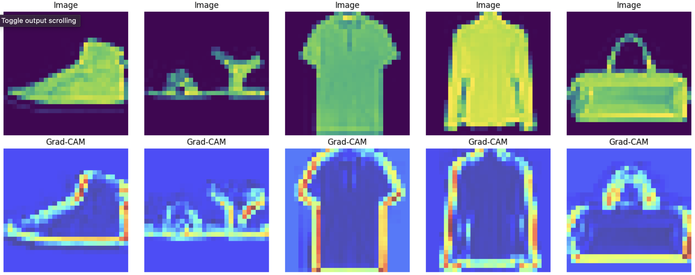
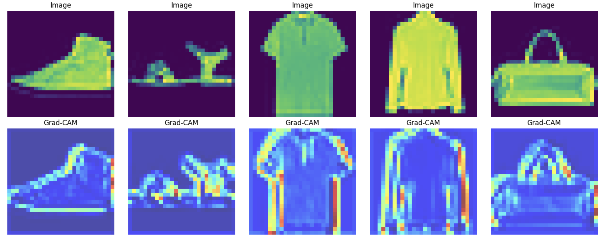

# Fashion MNIST Classification

## Dependencies

Before running the project, ensure that you have the required dependencies installed. You can choose one of the following methods:

### Method 1: Using requirements.txt

1. Open a terminal or command prompt.

2. Navigate to the project directory.

3. Run the following command to install the dependencies listed in the `requirements.txt` file:

    ```bash
    pip install -r requirements.txt
    ```

### Method 2: Using install_requirements.py

1. Open a terminal or command prompt.

2. Navigate to the project directory.

3. Run the following command to execute the `install_requirements.py` script:

    ```bash
    python install_requirements.py
    ```

   This script will install the required dependencies using `pip`.

# Data Organization

Before running the code, make sure to download the data from the below link and place it in the `Data` folder:

data - https://drive.google.com/drive/folders/1loTGJ2XxOBBh4R8nGSha1FeQMs2QTzkJ?usp=sharing

## Code For Evaluating Project
Run the **main.ipynb** file for evalutation of the project

# CNN Model Tuning Results

After thorough experimentation and tuning, the following three sets of model parameters demonstrated the highest validation accuracy. These configurations are recommended for their outstanding performance:

| Rank | Convolution 1 Filters | Convolution 2 Filters | Filter Size | Dense Layer | Validation Accuracy |
|------|------------------------|------------------------|-------------|-------------|----------------------|
| 1    | 32                     | 64                     | 3           | 64          | 92.01%               |
| 2    | 64                     | 128                    | 3           | 64          | 91.89%               |
| 3    | 64                     | 128                    | 3           | 32          | 91.84%               |

These configurations represent the top-performing models based on their validation accuracy.

# ResNet-Inspired Model Tuning Results

Inspired by the ResNet architecture, the following three configurations of the model were experimented with, showcasing their validation accuracies:

| Rank | Residual Blocks | Filters | Validation Accuracy |
|------|------------------|---------|----------------------|
| 1    | 3                | 64      | 92.81%               |
| 2    | 4                | 64      | 92.51%               |
| 3    | 5                | 64      | 92.11%               |

These configurations represent the top-performing models based on their validation accuracy.

These results represent the performance of the ResNet-inspired model with varying numbers of residual blocks and filters. The top-performing configuration with 3 residual blocks and 64 filters achieved an impressive validation accuracy of 92.81%. Consider utilizing these configurations as a solid foundation for your tasks or further customizing them based on specific requirements.

## Model Interpretability

### Grad-CAM Visualizations for Convolutional Layers

#### First Convolutional Layer


#### Second Convolutional Layer


The above images showcase the Grad-CAM visualizations for the first and second convolutional layers of the model. These visualizations offer insights into the areas of focus for each layer, providing a deeper understanding of the model's decision-making process.


# Best Model 

After thorough model tuning, the best-performing configuration was identified as follows:

| Residual Blocks | Filters | Validation Accuracy |
|------------------|---------|----------------------|
| 3                | 64      | 92.81%               |

## Model Evaluation Metrics after retraining it

### Test Set

| Loss   | Accuracy | Precision | Recall | F1 Score |
|--------|----------|-----------|--------|----------|
| 0.1954 | 92.95%   | 93.08%    | 92.95% | 92.98%   |

### Validation Set

| Loss   | Accuracy | Precision | Recall | F1 Score |
|--------|----------|-----------|--------|----------|
| 0.2226 | 92.28%   | 92.44%    | 92.28% | 92.33%   |

### Training Set

| Loss   | Accuracy | Precision | Recall | F1 Score |
|--------|----------|-----------|--------|----------|
| 0.1541 | 94.40%   | 94.83%    | 94.77% | 94.78%   |

These results indicate the performance of the best model on train, test, validation splits, showcasing promising accuracy and associated metrics.
